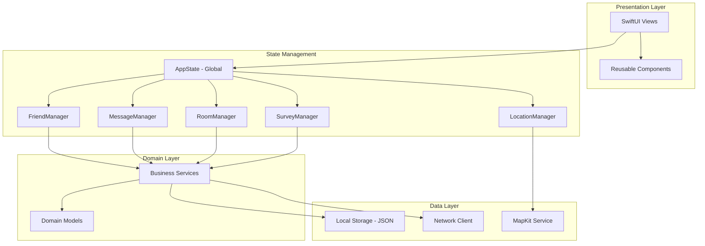

# Design Document: BadmintonBuddy v2.0 Upgrade

## Overview

This design document outlines the technical architecture for upgrading BadmintonBuddy from v1.0 to v2.0. The upgrade introduces six major feature sets that transform the app from a simple matching prototype into a full-featured social badminton platform.

The design follows SwiftUI best practices with @StateObject/@EnvironmentObject state management, maintains the existing dark-mode-only aesthetic, and ensures 60 FPS animation performance with memory constraints as specified.

### Key Design Decisions

1. **MapKit Integration**: Use Apple's native MapKit framework for real maps (no third-party dependencies)
2. **Local-First Architecture**: Core data persisted locally with background sync to server
3. **Modular State Management**: Extend AppState with feature-specific managers (FriendManager, MessageManager, etc.)
4. **Protocol-Oriented Design**: Define protocols for testability and flexibility

## Architecture

### High-Level Architecture



### State Management Architecture

```mermaid
graph LR
    subgraph "AppState (Extended)"
        CurrentUser[currentUser]
        CurrentScreen[currentScreen]
        SelectedMode[selectedMode]
        MatchedOpponent[matchedOpponent]
        IsMatching[isMatching]
        SelectedTimeSlot[selectedTimeSlot]
    end
    
    subgraph "Feature Managers"
        FM[FriendManager<br/>- friends: [User]<br/>- pendingRequests: [FriendRequest]]
        MM[MessageManager<br/>- threads: [MessageThread]<br/>- unreadCount: Int]
        RM[RoomManager<br/>- currentRoom: Room?<br/>- roomCode: String?]
        SM[SurveyManager<br/>- pendingSurveys: [Survey]<br/>- completedSurveys: [Survey]]
        LM[LocationManager<br/>- currentLocation: CLLocation?<br/>- nearbyPlayers: [User]]
    end
    
    AppState --> FM
    AppState --> MM
    AppState --> RM
    AppState --> SM
    AppState --> LM
```

## Components and Interfaces

### Core Protocols

```swift
// Location Service Protocol
protocol LocationServiceProtocol {
    var currentLocation: CLLocation? { get }
    var authorizationStatus: CLAuthorizationStatus { get }
    func requestAuthorization()
    func startUpdatingLocation()
    func stopUpdatingLocation()
    func isWithinRange(_ location: CLLocation, radiusMiles: Double) -> Bool
}

// Matching Service Protocol
protocol MatchingServiceProtocol {
    func findMatches(
        mode: GameMode,
        skillLevel: Int,
        location: CLLocation,
        timeSlot: TimeSlot,
        radiusMiles: Double
    ) async throws -> [MatchCandidate]
}

// Message Service Protocol
protocol MessageServiceProtocol {
    func sendMessage(_ message: Message, to userId: String) async throws
    func loadMessages(threadId: String, limit: Int) async throws -> [Message]
    func markAsRead(threadId: String) async throws
}

// Survey Service Protocol
protocol SurveyServiceProtocol {
    func submitSurvey(_ survey: MatchSurvey) async throws
    func getPendingSurveys() async throws -> [PendingSurvey]
    func calculateReputationScore(userId: String) -> ReputationScore
}

// Room Service Protocol
protocol RoomServiceProtocol {
    func createRoom(mode: GameMode) async throws -> Room
    func joinRoom(code: String) async throws -> Room
    func inviteToRoom(roomId: String, userId: String) async throws
    func leaveRoom(roomId: String) async throws
    func startMatch(roomId: String) async throws
}

// Persistence Protocol
protocol PersistenceServiceProtocol {
    func save<T: Encodable>(_ object: T, key: String) throws
    func load<T: Decodable>(key: String, type: T.Type) throws -> T?
    func delete(key: String) throws
}
```

### New View Components

```swift
// Map View with Real Location
struct RealMapView: View {
    @EnvironmentObject var locationManager: LocationManager
    @State var region: MKCoordinateRegion
    var nearbyPlayers: [User]
    var onPlayerTapped: (User) -> Void
}

// Player Annotation View
struct PlayerAnnotationView: View {
    let player: User
    let isSelected: Bool
}

// Time Slot Picker
struct TimeSlotPicker: View {
    @Binding var selectedDate: Date
    @Binding var startTime: Date
    @Binding var endTime: Date
    var minimumDuration: TimeInterval = 3600 // 1 hour
    var maximumDuration: TimeInterval = 28800 // 8 hours
}

// Friend List View
struct FriendListView: View {
    @EnvironmentObject var friendManager: FriendManager
    var onFriendSelected: (User) -> Void
}

// Room Lobby View
struct RoomLobbyView: View {
    @EnvironmentObject var roomManager: RoomManager
    let room: Room
    var onStartMatch: () -> Void
    var onLeaveRoom: () -> Void
}

// Message Thread View
struct MessageThreadView: View {
    @EnvironmentObject var messageManager: MessageManager
    let thread: MessageThread
    @State var messageText: String = ""
}

// Survey Form View
struct SurveyFormView: View {
    let match: CompletedMatch
    @State var skillRating: Int = 5
    @State var wasPunctual: Bool = true
    @State var characterRating: Int = 3
    var onSubmit: (MatchSurvey) -> Void
}

// Reputation Badge View
struct ReputationBadgeView: View {
    let reputation: ReputationScore
    var compact: Bool = false
}

// Skill Level Picker (1-9)
struct SkillLevelPicker: View {
    @Binding var selectedLevel: Int
    var maxSelectableLevel: Int = 7 // Levels 8-9 require verification
}
```

## Data Models

### Enhanced User Model

```swift
struct User: Identifiable, Codable, Equatable {
    let id: String
    var nickname: String
    var phone: String
    var selfReportedLevel: Int // 1-9
    var calculatedLevel: Double // Weighted average
    var totalGames: Int
    var wins: Int
    var joinDate: Date
    var location: Coordinate?
    var lastLocationUpdate: Date?
    var verificationStatus: VerificationStatus
    var reputation: ReputationScore
    
    var displayLevel: Int {
        // 70% peer evaluation, 30% self-reported (if enough evaluations)
        guard reputation.evaluationCount >= 5 else { return selfReportedLevel }
        return Int(round(calculatedLevel))
    }
    
    var winRate: Double {
        guard totalGames > 0 else { return 0 }
        return Double(wins) / Double(totalGames) * 100
    }
}

struct Coordinate: Codable, Equatable {
    let latitude: Double
    let longitude: Double
    
    func distance(to other: Coordinate) -> Double {
        // Haversine formula for distance in miles
        let earthRadiusMiles = 3958.8
        let lat1 = latitude * .pi / 180
        let lat2 = other.latitude * .pi / 180
        let deltaLat = (other.latitude - latitude) * .pi / 180
        let deltaLon = (other.longitude - longitude) * .pi / 180
        
        let a = sin(deltaLat/2) * sin(deltaLat/2) +
                cos(lat1) * cos(lat2) * sin(deltaLon/2) * sin(deltaLon/2)
        let c = 2 * atan2(sqrt(a), sqrt(1-a))
        
        return earthRadiusMiles * c
    }
}

enum VerificationStatus: String, Codable {
    case unverified
    case regionalChampion  // Required for level 8
    case nationalChampion  // Required for level 9
}
```

### Reputation and Survey Models

```swift
struct ReputationScore: Codable, Equatable {
    var averageSkillAccuracy: Double // How accurate their self-rating is
    var punctualityPercentage: Double // % of times they were on time
    var averageCharacterRating: Double // 1-5 scale
    var evaluationCount: Int
    
    var isNewPlayer: Bool { evaluationCount < 5 }
    
    static let empty = ReputationScore(
        averageSkillAccuracy: 0,
        punctualityPercentage: 100,
        averageCharacterRating: 3,
        evaluationCount: 0
    )
}

struct MatchSurvey: Identifiable, Codable {
    let id: String
    let matchId: String
    let evaluatorId: String
    let evaluatedUserId: String
    let skillRating: Int // 1-9
    let wasPunctual: Bool
    let characterRating: Int // 1-5
    let submittedAt: Date
}

struct PendingSurvey: Identifiable, Codable {
    let id: String
    let matchId: String
    let opponentId: String
    let opponentNickname: String
    let matchDate: Date
    let expiresAt: Date
    
    var isExpired: Bool { Date() > expiresAt }
}
```

### Room and Friend Models

```swift
struct Room: Identifiable, Codable {
    let id: String
    let code: String // 6-character alphanumeric
    let ownerId: String
    let mode: GameMode
    var participants: [RoomParticipant]
    let createdAt: Date
    var lastActivityAt: Date
    
    var requiredPlayerCount: Int {
        mode == .singles ? 2 : 4
    }
    
    var isReady: Bool {
        participants.count == requiredPlayerCount
    }
    
    var isExpired: Bool {
        Date().timeIntervalSince(lastActivityAt) > 1800 // 30 minutes
    }
    
    static func generateCode() -> String {
        let characters = "ABCDEFGHJKLMNPQRSTUVWXYZ23456789" // Exclude confusing chars
        return String((0..<6).map { _ in characters.randomElement()! })
    }
}

struct RoomParticipant: Identifiable, Codable, Equatable {
    let id: String
    let oderId: String
    let nickname: String
    let skillLevel: Int
    let joinedAt: Date
}

struct FriendRequest: Identifiable, Codable {
    let id: String
    let fromUserId: String
    let fromNickname: String
    let toUserId: String
    let sentAt: Date
    var status: FriendRequestStatus
}

enum FriendRequestStatus: String, Codable {
    case pending
    case accepted
    case declined
}

struct Friendship: Identifiable, Codable {
    let id: String
    let userId1: String
    let userId2: String
    let createdAt: Date
}
```

### Message Models

```swift
struct MessageThread: Identifiable, Codable {
    let id: String
    let participantIds: [String]
    var lastMessage: Message?
    var lastActivityAt: Date
    var unreadCount: Int
    
    func otherParticipantId(currentUserId: String) -> String? {
        participantIds.first { $0 != currentUserId }
    }
}

struct Message: Identifiable, Codable, Equatable {
    let id: String
    let threadId: String
    let senderId: String
    let content: String
    let sentAt: Date
    var deliveredAt: Date?
    var readAt: Date?
    
    var isDelivered: Bool { deliveredAt != nil }
    var isRead: Bool { readAt != nil }
}

struct BlockedUser: Identifiable, Codable {
    let id: String
    let blockedUserId: String
    let blockedAt: Date
}
```

### Time Slot and Matching Models

```swift
struct TimeSlot: Codable, Equatable {
    let date: Date
    let startTime: Date
    let endTime: Date
    
    var duration: TimeInterval {
        endTime.timeIntervalSince(startTime)
    }
    
    func overlaps(with other: TimeSlot) -> TimeSlot? {
        guard Calendar.current.isDate(date, inSameDayAs: other.date) else { return nil }
        
        let overlapStart = max(startTime, other.startTime)
        let overlapEnd = min(endTime, other.endTime)
        
        guard overlapEnd > overlapStart else { return nil }
        
        let overlapDuration = overlapEnd.timeIntervalSince(overlapStart)
        guard overlapDuration >= 1800 else { return nil } // 30 min minimum
        
        return TimeSlot(date: date, startTime: overlapStart, endTime: overlapEnd)
    }
}

struct RecurringTimeSlot: Identifiable, Codable {
    let id: String
    let dayOfWeek: Int // 1 = Sunday, 7 = Saturday
    let startTime: DateComponents // Hour and minute only
    let endTime: DateComponents
    let isActive: Bool
}

struct MatchCandidate: Identifiable {
    let id: String
    let user: User
    let distance: Double // miles
    let skillDifference: Int
    let overlappingTimeSlot: TimeSlot
    
    var matchScore: Double {
        // Lower is better: prioritize skill match, then distance
        let skillWeight = 10.0
        let distanceWeight = 1.0
        return Double(abs(skillDifference)) * skillWeight + distance * distanceWeight
    }
}
```

### Enhanced Game Mode and Match Result

```swift
enum GameMode: String, CaseIterable, Identifiable, Codable {
    case singles = "单打"
    case doubles = "双打"
    
    var id: String { rawValue }
    
    var icon: String {
        switch self {
        case .singles: return "🎯"
        case .doubles: return "🤝"
        }
    }
    
    var description: String {
        switch self {
        case .singles: return "1 vs 1 对决"
        case .doubles: return "2 vs 2 组队"
        }
    }
    
    var requiredPlayers: Int {
        switch self {
        case .singles: return 2
        case .doubles: return 4
        }
    }
}

struct CompletedMatch: Identifiable, Codable {
    let id: String
    let mode: GameMode
    let participants: [String] // User IDs
    let venue: String
    let scheduledTime: Date
    let completedAt: Date?
    var surveyStatus: [String: SurveyStatus] // userId -> status
}

enum SurveyStatus: String, Codable {
    case pending
    case completed
    case expired
}
```


## Correctness Properties

*A property is a characteristic or behavior that should hold true across all valid executions of a system—essentially, a formal statement about what the system should do. Properties serve as the bridge between human-readable specifications and machine-verifiable correctness guarantees.*

### Property 1: Geofence Filtering

*For any* set of users with locations and a current user location, the filtered list of nearby players SHALL contain only users whose distance from the current user is less than or equal to 50 miles.

**Validates: Requirements 1.3**

### Property 2: Skill Level Self-Assignment Validation

*For any* skill level value from 1 to 9, the system SHALL accept self-assignment for levels 1-7 and reject self-assignment for levels 8-9 (which require verification).

**Validates: Requirements 2.1, 2.2**

### Property 3: Weighted Skill Level Calculation

*For any* user with 5 or more peer evaluations, the calculated skill level SHALL equal `0.3 * selfReportedLevel + 0.7 * averagePeerEvaluation`, rounded to the nearest integer.

**Validates: Requirements 2.6**

### Property 4: New Player Badge Display

*For any* user with fewer than 5 peer evaluations, the displayed skill level SHALL be the self-reported level and the `isNewPlayer` flag SHALL be true.

**Validates: Requirements 2.7**

### Property 5: Survey Generation on Match Completion

*For any* completed match with N participants, the system SHALL generate exactly N pending surveys (one for each participant to evaluate others).

**Validates: Requirements 2.5**

### Property 6: Bidirectional Friend Relationship

*For any* accepted friend request between users A and B, user A's friend list SHALL contain user B AND user B's friend list SHALL contain user A.

**Validates: Requirements 3.2**

### Property 7: Room Code Uniqueness and Format

*For any* set of generated room codes, all codes SHALL be unique, exactly 6 characters long, and contain only alphanumeric characters (excluding confusing characters like 0, O, 1, I, L).

**Validates: Requirements 3.4**

### Property 8: Room Ready State

*For any* room with game mode M, the room SHALL be in ready state (`isReady = true`) if and only if the participant count equals the required player count for mode M (2 for singles, 4 for doubles).

**Validates: Requirements 3.6**

### Property 9: Room Expiration

*For any* room where the time since `lastActivityAt` exceeds 30 minutes, the room SHALL be marked as expired (`isExpired = true`).

**Validates: Requirements 3.8**

### Property 10: Kick Removes Participant

*For any* room and participant, after a kick operation on that participant, the room's participant list SHALL NOT contain that participant.

**Validates: Requirements 3.10**

### Property 11: Date Selection Validation

*For any* date selected for matching, the system SHALL accept dates within the next 14 days from today and reject dates outside this range.

**Validates: Requirements 4.1**

### Property 12: Time Slot Duration Validation

*For any* time slot with start and end times, the system SHALL accept durations between 1 hour (3600 seconds) and 8 hours (28800 seconds) inclusive, and reject durations outside this range.

**Validates: Requirements 4.2**

### Property 13: Time Slot Overlap Calculation

*For any* two time slots on the same day, the `overlaps` function SHALL return a valid overlapping TimeSlot if and only if the overlap duration is at least 30 minutes, otherwise it SHALL return nil.

**Validates: Requirements 4.3**

### Property 14: Match Candidate Ordering

*For any* list of match candidates, when sorted by match score, candidates SHALL be ordered primarily by skill level difference (ascending) and secondarily by distance (ascending) for candidates with equal skill differences.

**Validates: Requirements 4.4, 4.5**

### Property 15: Recurring Time Slot Limit

*For any* user, the system SHALL allow saving between 1 and 5 recurring time slot preferences, and reject attempts to save more than 5.

**Validates: Requirements 4.8**

### Property 16: Message Character Limit

*For any* message content, the system SHALL accept messages with 1 to 1000 characters and reject messages with 0 characters or more than 1000 characters.

**Validates: Requirements 5.7**

### Property 17: Block Prevents Message Delivery

*For any* blocked user relationship where user A has blocked user B, messages sent from user B to user A SHALL NOT be delivered to user A.

**Validates: Requirements 5.5**

### Property 18: Conversation Soft Delete

*For any* conversation deleted by user A, the conversation SHALL NOT appear in user A's thread list but SHALL remain visible in the other participant's thread list.

**Validates: Requirements 5.9**

### Property 19: Survey Structure Completeness

*For any* submitted survey, it SHALL contain all three required fields: skill rating (1-9), punctuality (boolean), and character rating (1-5).

**Validates: Requirements 6.2**

### Property 20: Survey Deadline Enforcement

*For any* pending survey, if the current time exceeds 48 hours after match completion, the survey SHALL be marked as expired and submission SHALL be rejected.

**Validates: Requirements 6.3, 6.4**

### Property 21: Survey Uniqueness Per Match

*For any* match and evaluator user, the system SHALL accept at most one survey submission and reject subsequent submissions for the same match-evaluator pair.

**Validates: Requirements 6.8**

### Property 22: Data Serialization Round-Trip

*For any* valid User, Room, Message, or Survey object, serializing to JSON and then deserializing SHALL produce an object equivalent to the original.

**Validates: Requirements 9.4**

### Property 23: JSON Parse Error Location

*For any* invalid JSON input, the parse error SHALL include the character position or line/column where the error occurred.

**Validates: Requirements 9.5**

### Property 24: Color Contrast Compliance

*For any* text color and background color pair used in the UI, the contrast ratio SHALL be at least 4.5:1 as per WCAG 2.1 AA guidelines.

**Validates: Requirements 8.1**

### Property 25: Accessibility Label Coverage

*For any* interactive UI element (buttons, text fields, toggles), the element SHALL have a non-empty accessibility label for VoiceOver support.

**Validates: Requirements 8.2**

### Property 26: Localization Coverage

*For any* user-facing string key in the application, there SHALL exist a corresponding Chinese (zh-CN) localized string.

**Validates: Requirements 8.3**

### Property 27: Distance Calculation Accuracy

*For any* two coordinates, the calculated distance using the Haversine formula SHALL be within 0.1% of the actual great-circle distance.

**Validates: Requirements 1.3 (supporting property)**

## Error Handling

### Location Errors

| Error Condition | System Response | User Message |
|----------------|-----------------|--------------|
| Location permission denied | Show permission prompt | "需要位置权限才能找到附近的球友" |
| Location services disabled | Show settings prompt | "请在设置中开启定位服务" |
| Location unavailable | Use last known location | "位置暂时不可用，显示上次位置" |
| GPS accuracy low | Show accuracy indicator | "位置精度较低，正在优化..." |

### Network Errors

| Error Condition | System Response | User Message |
|----------------|-----------------|--------------|
| No network connection | Enable offline mode | "网络不可用，已切换到离线模式" |
| Request timeout | Retry with backoff | "连接超时，正在重试..." |
| Server error (5xx) | Retry up to 3 times | "服务器繁忙，请稍后再试" |
| Auth token expired | Refresh token | Silent refresh, no message |

### Validation Errors

| Error Condition | System Response | User Message |
|----------------|-----------------|--------------|
| Invalid skill level (8-9) | Reject selection | "8-9级需要赛事认证，请选择1-7级" |
| Message too long | Prevent send | "消息不能超过1000字" |
| Room code invalid | Show error | "房间码无效，请检查后重试" |
| Time slot invalid | Show validation | "时间段需要1-8小时" |
| Survey expired | Prevent submission | "问卷已过期，无法提交" |

### Room Errors

| Error Condition | System Response | User Message |
|----------------|-----------------|--------------|
| Room full | Reject join | "房间已满" |
| Room expired | Close room | "房间已过期" |
| Not room owner | Reject action | "只有房主可以执行此操作" |
| User already in room | Reject join | "您已在房间中" |

### Rollback Strategy

For critical operations, the system implements a rollback mechanism:

1. **Friend Request**: If notification delivery fails, mark request as pending retry
2. **Room Creation**: If code generation fails, retry with new code
3. **Survey Submission**: If server sync fails, store locally and retry
4. **Message Send**: If delivery fails, mark as pending and retry on reconnect

## Testing Strategy

### Dual Testing Approach

This project uses both unit tests and property-based tests for comprehensive coverage:

- **Unit Tests**: Verify specific examples, edge cases, and error conditions
- **Property Tests**: Verify universal properties across randomly generated inputs

### Property-Based Testing Configuration

- **Framework**: SwiftCheck (Swift property-based testing library)
- **Minimum Iterations**: 100 per property test
- **Tag Format**: `Feature: badminton-buddy-v2-upgrade, Property {N}: {property_text}`

### Test Categories

#### Unit Tests (60-80% coverage)

1. **Model Validation Tests**
   - User model initialization and computed properties
   - TimeSlot overlap edge cases (same start, same end, no overlap)
   - Room code generation format validation
   - Reputation score calculation with boundary values

2. **Service Logic Tests**
   - Location permission state handling
   - Message delivery status transitions
   - Survey expiration logic
   - Friend request state machine

3. **Error Handling Tests**
   - Invalid JSON parsing errors
   - Network timeout handling
   - Validation rejection messages

#### Property Tests (15-30% coverage)

Each correctness property from the design document will be implemented as a property-based test:

1. **Property 1**: Geofence filtering - generate random user locations, verify all returned users within 50 miles
2. **Property 2**: Skill level validation - generate levels 1-9, verify acceptance/rejection
3. **Property 3**: Weighted calculation - generate users with evaluations, verify formula
4. **Property 6**: Bidirectional friendship - generate friend requests, verify symmetry
5. **Property 7**: Room code uniqueness - generate many codes, verify uniqueness
6. **Property 13**: Time slot overlap - generate random time slots, verify overlap calculation
7. **Property 14**: Match ordering - generate candidates, verify sort order
8. **Property 22**: Serialization round-trip - generate valid objects, verify encode/decode equality
9. **Property 27**: Distance calculation - generate coordinates, verify Haversine accuracy

#### Integration Tests (≤10% coverage)

1. **Map Integration**: MapKit region updates with location changes
2. **Persistence Integration**: Local storage read/write cycles
3. **State Management**: AppState transitions through user flows

### Test File Structure

```
BadmintonBuddy-iOS/
├── BadmintonBuddyTests/
│   ├── Models/
│   │   ├── UserTests.swift
│   │   ├── RoomTests.swift
│   │   ├── TimeSlotTests.swift
│   │   └── MessageTests.swift
│   ├── Services/
│   │   ├── LocationServiceTests.swift
│   │   ├── MatchingServiceTests.swift
│   │   └── SurveyServiceTests.swift
│   ├── Properties/
│   │   ├── GeofencePropertyTests.swift
│   │   ├── SkillLevelPropertyTests.swift
│   │   ├── TimeSlotPropertyTests.swift
│   │   ├── RoomPropertyTests.swift
│   │   └── SerializationPropertyTests.swift
│   └── Integration/
│       ├── MapIntegrationTests.swift
│       └── PersistenceIntegrationTests.swift
```

### CI/CD Pipeline Requirements

```yaml
# Pipeline stages for BadmintonBuddy v2
stages:
  - build
  - lint
  - test
  - security
  - deploy

build:
  - xcodebuild -scheme BadmintonBuddy -configuration Debug

lint:
  - swiftlint lint --strict

test:
  - unit_tests: xcodebuild test -scheme BadmintonBuddy
  - property_tests: minimum 100 iterations per property
  - coverage_threshold: 70%

security:
  - dependency_scan: check for vulnerable packages
  - static_analysis: SwiftLint security rules

deploy:
  - staging: TestFlight internal
  - canary: 5% rollout
  - production: full rollout after 24h canary success
  - rollback_trigger: crash rate > 1% or error rate > 5%
```
